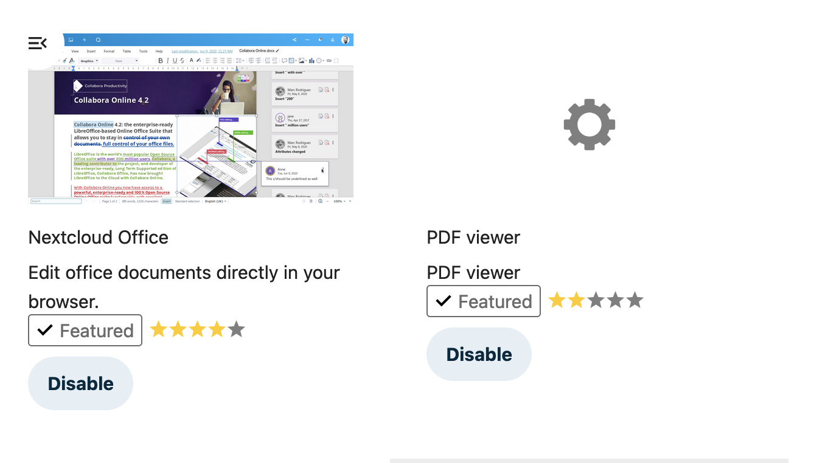
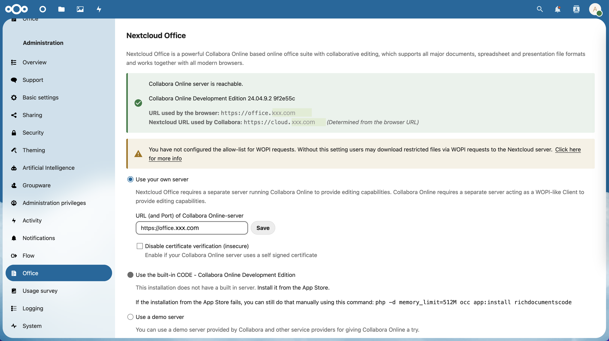
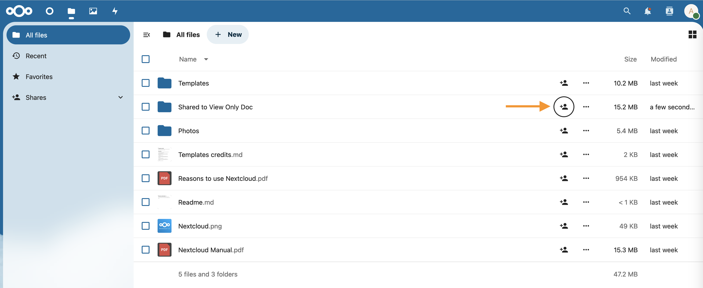
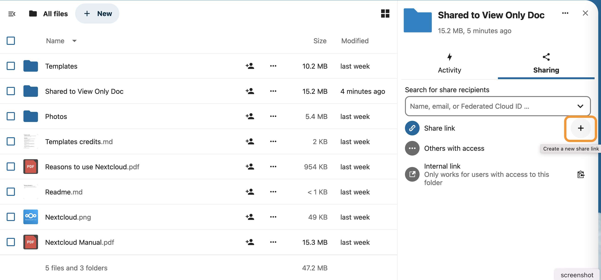
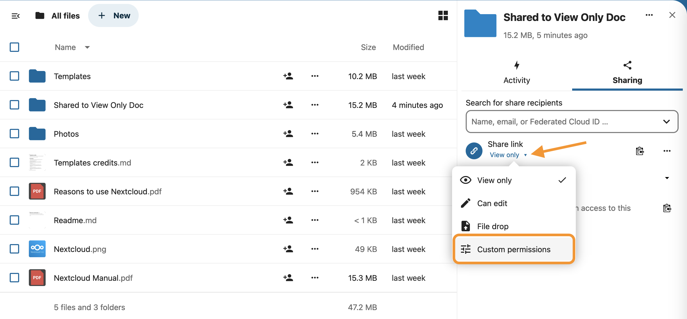
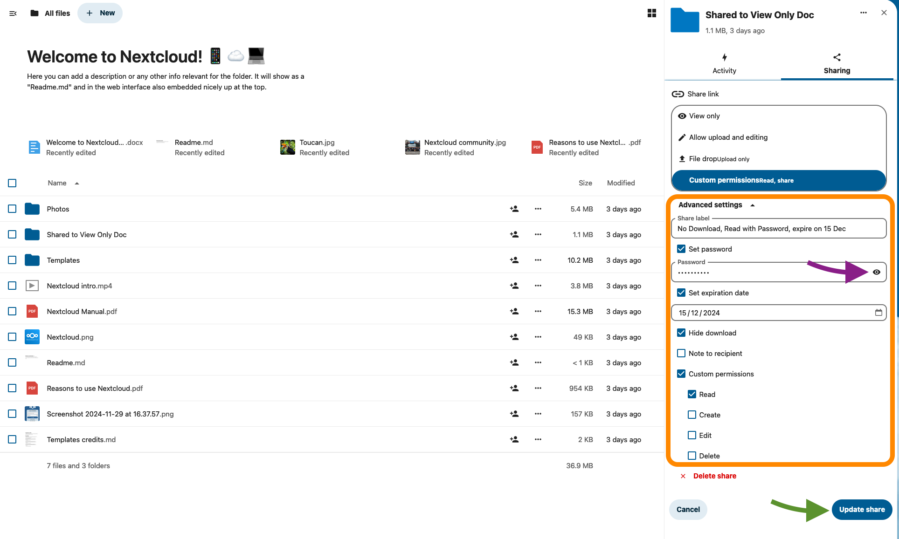
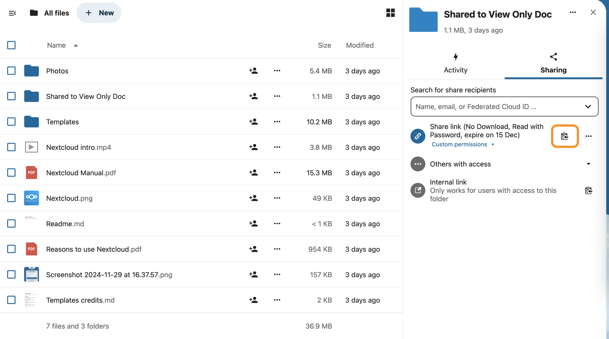
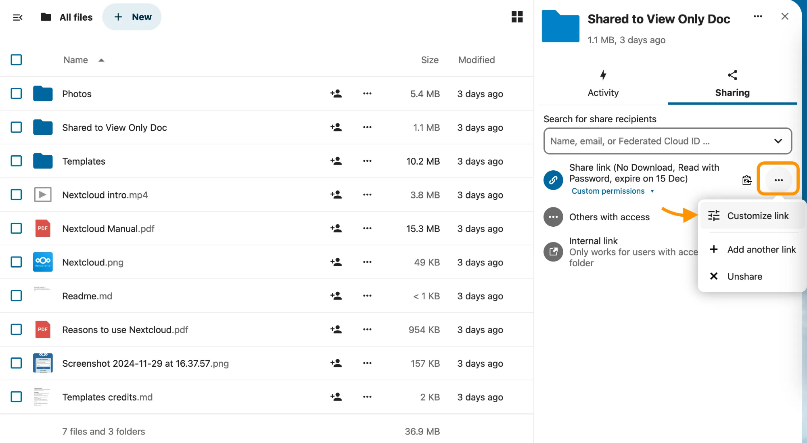
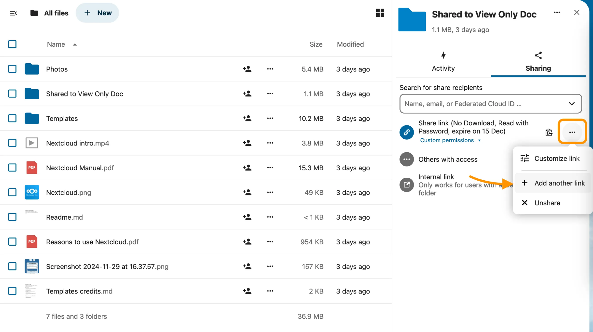
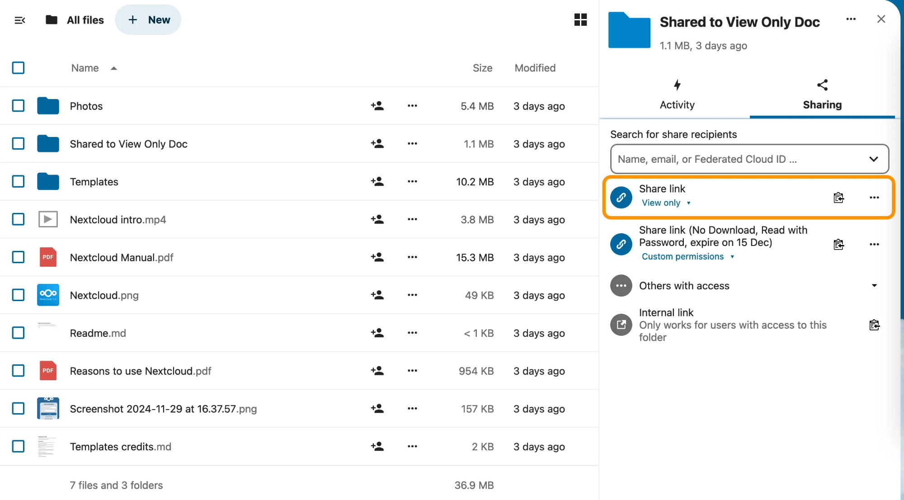

## Explanation
1. Set the domain names `cloud.xxx.com` and `office.xxx.com`

2. Set DNS for `cloud.xxx.com` and `office.xxx.com` (can be DNS only without proxy)

3. Set `traefik` at the server 
* ref file: `traefik/docker-compose.yaml`
* also make the Let's Encrypt SSL cert for the domain names
* use command `cd <path of traefik folder> && docker compose up -d` to start traefik service

4. Docker Deploy for NextCloud(app + db) and Collabora(CODE Edition) 
* ref file: `nextcloud/docker-compose.yaml` and `collabora-online-development-edition/docker-compose.yaml`
* set the domain names for traefik routing 
* Nextcloud using port 80 thus set `traefik.http.services.cloud-xxx-app.loadbalancer.server.port=80`
* Collabora using port 9980 thus set `traefik.http.services.office-xxx-app.loadbalancer.server.port=9980`
* environment of collabora need set  `extra_params=--o:ssl.enable=false --o:ssl.termination=true`
* use command `cd <path of nextcloud folder> && docker compose up -d` to start Nexcloud service
* use command `cd <path of collabora folder> && docker compose up -d` to start Collabora service

5. Access Nextcloud system via `https://cloud.xxx.com`, initiate the system by setting the admin account.

6. confirm the content of `config.php` inside `nextcloud_app_container`, execute the following commands to open the `config.php` in console editor (nano editor).
```shell
docker exec -it nextcloud_app_container bash
apt get update
apt install nano
nano /var/www/html/config/config.php
```

7. change the following lines if necessary:
* add `trusted_domains`:
```php
  'trusted_domains' =>
  array (
    0 => 'cloud.xxx.com',
  ),
```

* change `overwrite.cli.url` to domain name
```php
  'overwrite.cli.url' => 'https://cloud.xxx.com',
```

* add overwrite settings
```php
  'overwritehost' => 'cloud.xxx.com',
  'overwriteprotocol' => 'https',
```
* save the changes on the nano editor by clicking `ctrl + X` keys, click `Y` key for change and `Enter` key to save the file. 


8. use command `exit` to exit the `nextcloud_app_container`, and run command `cd <path of collabora folder> && docker compose restart` to restart the `nextcloud_app_container`. 


## Access Websites
Access Nextcloud via `https://cloud.xxx.com`

Nextcloud will check whether Collabora works fine by accessing `https://office.xxx.com/hosting/discovery`

User access the Admin Page of Collabora via `https://office.xxx.com/browser/dist/admin/admin.html`


[Ref. website](https://help.nextcloud.com/t/collabora-integration-guide/151879) for introducing the Flow of Communication between Nextcloud and Collabora


## Configuration on Nextcloud to communicate with Collabora

1. Login as Admin, click to top-right corner go to `Apps` and then choose `Office & text` tab on the left bar (https://cloud.xxx.com/settings/apps/office)

2. Choose to download `Nextcloud Office`


3. click to top-right corner go to `Administration settings` and then choose `Office` tab on the left bar (https://cloud.xxx.com/settings/apps/office)

4. set the URL for Collabora Online-server, click `Save`


5. If all settings are good, then a Green Tick is shown above. Open a `.doc / .odc` file should go to a online editor.


## Sharing Settings on Nextcloud

### Recommend Sharing Method (share to public with Password)

1. Click on the Sharing icon on the folder / file, it will open the side panel for sharing settings


2. Click the + icon on Share link to create a new share link


3. newly created link is set to be `View only` by default. 
Click on the drop-down arrow on the right, and change it to `Custom permissions`



4. Scroll down can see the options on Custom permissions
    - Input some descriptions at `Share label` can help management when having multiple share link on the same folder / file 
    - Check the box for `Set password` can create password, so anyone have this shared link need to entry password for viewing the shared files 
        - password is auto-generated when this box is checked, view the password by clicking the eye icon (indicated with purple arrow)
        - password can be customized, but need to be 10 characters long and not common
        > [!CAUTION]
        > Remember to keep the password **at once**
        >  - there is no way to view what password is set for this share link later
        >  - set **new password** for this share link if the password is forgot
    - Check the box for `Set expiration` date can set the expiration date for this sharing link
    - Check the box for `Hide download` can hide the download buttons, so anyone using this shared link cannot download the files
    - `Note to recipient` not working properly in the current Nextcloud version
    - Check the box `Custom permissions` and check only the sub-options `Read` to only give Read Permission

5. Click `Update share` (indicated with green arrow) to save the settings


6. Click the buttons (with the clipboard icon) on the right of the Share link to copy the link. 
Remember to send this share link with the password if `Set password` is chosen. 


7. Modify the share setting for this share link by clicking on the right-most menu button and select `Customize link`, will show the setting options again.


8. Add more share links if necessary. Click on the right-most menu button and select `Add another link`


9. A new share link is created with the default name `Share link` and default setting `View only`. Remember to set `Share label` for distinguishing the share links. 



